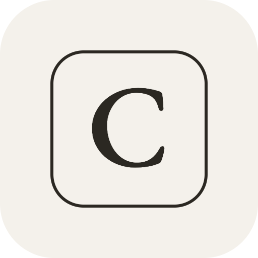

### Hi, I'm Helena

Software engineer and former brand marketer. I build iOS apps and data products, help teams automate their workflows, and write about technology and culture.

[helenadw.com](https://helenadw.com) &nbsp;·&nbsp; [Newsletter](https://helenadw.substack.com) &nbsp;·&nbsp; [X](https://x.com/helenadw) &nbsp;·&nbsp; [TikTok](https://tiktok.com/@helenacdw) &nbsp;·&nbsp; [LinkedIn](https://linkedin.com/in/helenadw)

**Currently** — focusing on Composition, and setting up an AI & workflow automation service.

---

###  Hard Tech UK

A directory of the UK's hard tech ecosystem — startups, investors, and open
roles across robotics, quantum, aerospace, and deep tech.

[Find a role →](https://hardtechuk.com/jobs) &nbsp;·&nbsp; [Post a role →](https://hardtechuk.com/jobs/submit) &nbsp;·&nbsp; [Get the weekly newsletter →](https://hardtechuk.substack.com)

---

###  Composition

A body-composition tracker for iPhone. Reads the trend behind your weigh-ins and
tells you each week whether you're holding muscle, dropping fat, or spinning your
wheels.

[trackcomposition.com →](https://trackcomposition.com)

---

Available for AI & workflow automation consulting → [Ops & AI](https://opsandai.helenadw.com)
